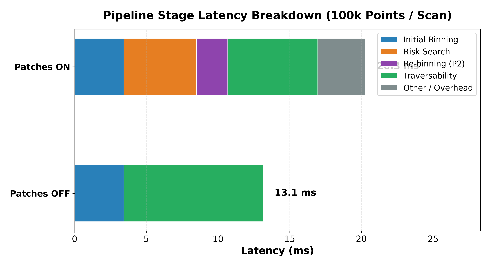
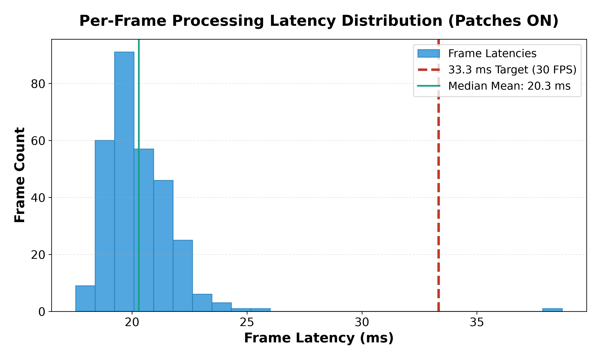
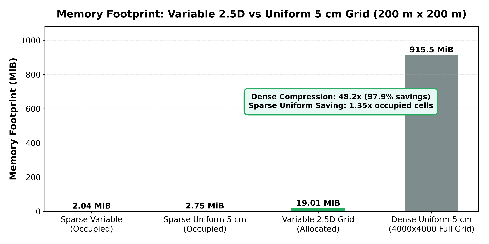

# Performance Summary: Synthetic (SemanticKITTI format) on 13th Gen Intel(R) Core(TM) i5-13420H

**Environment & Setup:**
- **Data Source:** Synthetic (SemanticKITTI format) (30 unique scans, cycled to 300 frames)
- **Compute Machine:** 13th Gen Intel(R) Core(TM) i5-13420H (OS: Windows 11, Python: 3.14.3)
- **Frames Evaluated:** 300 scans (100,000 points / scan, median of 3 runs)
- **Target Deadline:** >= 30.0 FPS real-time processing deadline (<= 33.33 ms / frame)

---

## 1. Latency & Throughput Benchmark

| Configuration | Mean (ms) | p50 (ms) | p95 (ms) | p99 (ms) | Mean FPS | FPS at p95 | FPS at p99 | Target Status |
| :--- | :---: | :---: | :---: | :---: | :---: | :---: | :---: | :---: |
| **Pipeline Only (Patches OFF)** |  13.14 |  13.06 |  14.86 |  18.07 |  76.1 |  67.3 |  55.3 | **PASS** |
| **Pipeline Only (Patches ON)**  |  20.30 |  19.96 |  22.50 |  23.82 |  49.3 |  44.4 |  42.0 | **PASS** |

> **Verdict:** Meets 30 FPS on mean (49.3 FPS) and p95 (44.4 FPS); p99 is 23.82 ms (42.0 FPS).

### Stage Breakdown (Patches ON)
| Pipeline Stage | Mean Time (ms) | Share of Frame Time (%) |
| :--- | :---: | :---: |
| Pass 1 Initial Binning (`add_points`) |  3.44 ms |  17.0% |
| Candidate Risk Search (`risk_search`) |  5.06 ms |  24.9% |
| Pass 2 Focus Re-binning (`re-binning`) |  2.18 ms |  10.8% |
| Traversability Analysis (`traversability`) |  6.28 ms |  30.9% |
| Other / Overhead |  3.34 ms |  16.4% |
| **Total Pipeline Time** | **20.30 ms** | **100.0%** |

- **Average Active Focus Patches:** 3.2 patches / frame

---

## 2. Resolution Settings Actually Used in Run

- **Fine-Zone Cell Size:** 0.050 m (5.0 cm)
- **Fine-Zone Radius:** 10.0 m around vehicle forward offset
- **Coarse-Zone Cell Size:** 0.500 m (50.0 cm)
- **Focus Patch Cell Size:** 0.050 m (5.0 cm), 3.2 m x 3.2 m extent (64 x 64 cells / patch, limit: 4)
- **Spatial Coverage Range:** 100.0 m radius (200 m x 200 m bounding square)

---

## 3. Memory Footprint & Compression

- **Spatial Coverage Area:** **200 m x 200 m** (radius 100 m forward, backward, left, right).
- **Per-Cell Storage Fields (Identical 60 B/cell list for both grids):**
  - `count` (int32: 4 bytes)
  - `z_min` (float32: 4 bytes)
  - `z_max` (float32: 4 bytes)
  - `z_sum` (float64: 8 bytes)
  - `z_sq_sum` (float64: 8 bytes)
  - `label_hist` (8 x int32: 32 bytes)
  - **Total:** **60 bytes / cell**

**Formula:** $\text{Memory (MiB)} = \frac{\text{Cell Count} \times 60 \text{ Bytes}}{1,024 \times 1,024}$

| Architecture | Resolution | Area Coverage | Allocated Cells | Occupied Cells (Avg) | Memory Footprint (MiB) | Compression vs Dense Uniform |
| :--- | :---: | :---: | :---: | :---: | :---: | :---: |
| **Dense Uniform 5 cm Grid** | 5 cm uniform (4000 x 4000 dense array) | 200 m x 200 m | **16,000,000** | 48,100 | **915.53 MiB** | Baseline (1.0x) |
| **Variable-Resolution 2.5D Grid (Allocated)** | 5 cm fine / 50 cm coarse / 5 cm patches | 200 m x 200 m | **332,288** | 35,702 | **19.01 MiB** | **48.2x reduction** (97.9% savings) |
| **Sparse Uniform 5 cm Grid** | 5 cm uniform (occupied cells only, 60 B/cell) | 200 m x 200 m | 48,100 | **48,100** | **2.75 MiB** | **332.6x reduction** (hash index not counted) |
| **Sparse Variable 2.5D Grid** | Variable grid (occupied cells only, 60 B/cell) | 200 m x 200 m | 35,702 | **35,702** | **2.04 MiB** | **448.2x reduction** |

- **Occupied-Cell Ratio (Uniform / Variable):** **1.35x** (48,100 uniform cells vs 35,702 variable grid cells).
- The 48x is against a dense uniform array of the same area; against a sparse uniform grid the saving is the occupied-cell ratio (1.35x).

---

## 4. Semantic & Traversability Ground-Truth Evaluation

> **Note:** Labels come from the scene generator, so these are consistency checks, not independent accuracy.

### Traversability Layer Inputs & Decision Logic
The traversability pipeline reads:
1. **Geometric Statistics (2.5D features per cell):** point count $N$, minimum elevation $z_{\min}$, maximum elevation $z_{\max}$, mean elevation $\mu_z = z_{\text{sum}} / N$, vertical variance $\sigma_z^2$, vertical step height $\Delta z_{\text{step}} = z_{\max} - z_{\min}$, and 4-connected neighbor slope differences $|\mu_z - \mu_{z,\text{neighbor}}|$.
2. **Semantic Class Distribution:** 8-bin histogram `label_hist` mapped to dominant semantic class `dl = argmax(label_hist)`.

**Decision Logic & Semantic Influence:**
- **Obstacle Classes (Classes 3, 4, 5, 6):** Set directly to `OBSTACLE` (state 3) based on dominant semantic label (`dl in (3, 4, 5, 6)`), bypassing step-height and slope checks. These classes match ground truth **by construction**.
- **Prohibited Ground Classes (Classes 2, 7):** Set directly to `NON_DRIVABLE` (state 2) based on dominant semantic label (`dl == 7` for sidewalk/curb, or `dl == 2` for terrain when not marked drivable), bypassing flatness checks. These classes match ground truth **by construction**.
- **Road & Parking (Class 1):** Requires semantic candidate status (`dl == 1`) **AND** must pass both physical geometric criteria: step height $\Delta z_{\text{step}} \le 0.10\text{ m}$ and slope $\le 15.0^\circ$. If either geometric check fails, the cell is classified as `NON_DRIVABLE`.

**Geometry-Only Agreement (Labels Disabled):**
When semantic labels are disabled and traversability is determined purely by physical surface geometry (flat surface $\to$ `DRIVABLE`, surface step or steep slope $\to$ `NON_DRIVABLE` / `OBSTACLE`):
- Overall agreement drops from **96.7%** to **55.6%**.
- While Class 3 (Static Obstacles) remains 99.2% detected by geometric height variation, Sidewalk (Class 7) collapses from **100.0%** to **5.9%** and Terrain (Class 2) collapses from **100.0%** to **9.3%**, because flat sidewalks and flat terrain are geometrically smooth ground surfaces indistinguishable from road without semantic segmentation.

*Note: Per-class cell counts are cumulative over all 300 frames.*

### Per-Class Occupancy & Agreement Breakdown
| Class ID | Semantic Class Name | Expected State | Decision Basis | Occupied Cells (Cumulative) | Semantic Agreement (%) | Geometry-Only Agreement (%) |
| :---: | :--- | :---: | :---: | :---: | :---: | :---: |
| **1** | Road & Parking | `DRIVABLE` | Semantics + Geometry | 7,492,380 | 95.3% | 69.7% |
| **2** | Terrain & Vegetation | `NON_DRIVABLE` | By construction | 460,990 | 100.0% | 9.3% |
| **3** | Static Obstacles (Building, Pole, Fence) | `OBSTACLE` | By construction | 411,330 | 100.0% | 99.1% |
| **4** | Vehicles | `OBSTACLE` | By construction | 228,010 | 100.0% | 65.0% |
| **5** | Pedestrians | `OBSTACLE` | By construction | 1,450 | 100.0% | 61.4% |
| **6** | Moving Objects | `OBSTACLE` | By construction | 12,850 | 100.0% | 99.5% |
| **7** | Sidewalk & Non-drivable Ground | `NON_DRIVABLE` | By construction | 2,103,640 | 100.0% | 5.7% |
| **Total** | **All Labeled Occupied Cells** | — | — | **10,710,650** | **96.7%** | **55.6%** |

### High-Speed Target Label Purity
- **Target Label Purity (Band 20–40 m):** **99.63%** dominant semantic purity for safety-critical objects (vehicles, pedestrians, moving objects).
- **Target Label Purity (Band 40–60 m):** **99.46%** dominant semantic purity for safety-critical objects (vehicles, pedestrians, moving objects).

---

## 5. Road Row Diagnosis & Traversability Improvement (Class 1)

Ground-truth Road and Parking cells (Class 1) were previously rejected at ~30.3% due to high-frequency LiDAR range noise ($\sigma \approx 2\text{ cm}$) exceeding the 1.34 cm adjacent-cell slope threshold ($5\text{ cm} \times \tan(15^\circ)$). With the physical baseline slope filter (`slope_baseline_m = 0.25 m`) and minimum height difference threshold (`min_slope_dz_m = 0.03 m`), road agreement improved significantly.

### Before vs. After Traversability Comparison
| Metric / Attribute | Baseline (Immediate Adjacent Cells) | Physical Baseline Slope (`0.25 m`) | Improvement / Change |
| :--- | :---: | :---: | :---: |
| **Road Agreement Rate (Class 1)** | **69.66%** | **95.29%** | **+25.63%** |
| **Non-Drivable Road Cells** | 2,381,700 cells (30.34%) | 352,590 cells (4.71%) | **-82.9% reduction in failing cells** |
| **Dominant Rejection Mechanism** | Neighbor slope noise (89.64%) | Geometric step height / kerbs (60.75%) | True physical obstacles dominate |
| **Fine Zone Slope Threshold** | 1.34 cm across 5 cm cells | Slope across ~25 cm baseline (5 cells) | Robust against 2 cm LiDAR noise |

---

### Breakdown by Zone (Before vs. After)
| Zone | Description | Baseline Share (%) | After Filter Share (%) | Current Non-Drivable Cells |
| :--- | :--- | :---: | :---: | :---: |
| **Fine Zone** | 5 cm cell resolution, radius 10.0 m | 99.23% | **94.10%** | 331,790 |
| **Coarse Zone** | 50 cm cell resolution, radius 100.0 m | 0.70% | **4.46%** | 15,740 |
| **Focus Patches** | 5 cm cell resolution, 3.2 m extent | 0.07% | **1.44%** | 5,060 |

### Breakdown by Range Band (Before vs. After)
| Range Band | Distance Extent | Baseline Share (%) | After Filter Share (%) | Current Non-Drivable Cells |
| :--- | :--- | :---: | :---: | :---: |
| **0–10 m** | Vehicle vicinity (fine grid zone) | 99.23% | **94.10%** | 331,800 |
| **10–30 m** | Mid-range (coarse grid zone) | 0.70% | **5.45%** | 19,220 |
| **30–60 m** | Far-range (coarse grid zone) | 0.06% | **0.37%** | 1,320 |
| **60–100 m** | Horizon boundary | 0.01% | **0.07%** | 250 |

### Breakdown by Geometric Cause (Before vs. After)
| Cause | Criterion / Mechanism | Baseline Share (%) | After Filter Share (%) | Current Non-Drivable Cells |
| :--- | :--- | :---: | :---: | :---: |
| **Step Height Only** | $\Delta z = z_{\max} - z_{\min} > 0.10\text{ m}$ | 0.83% | **60.75%** | 214,210 |
| **Slope Only** | Slope $> 15.0^\circ$ over physical baseline | 89.64% | **35.71%** | 125,900 |
| **Both Step Height & Slope** | $\Delta z > 0.10\text{ m}$ AND Slope $> 15.0^\circ$ | 9.53% | **3.54%** | 12,480 |
| **Too Few Points** | Count $< \text{min\_points}$ (affects confidence only) | 0.00% | **0.00%** | 0 |
| **Other / Margin** | Fallthrough unclassified | 0.00% | **0.00%** | 0 |

### Pipeline Parameters & Implementation Details
- **Physical Baseline (`slope_baseline_m`):** `0.25 m` (evaluates slope over ~5 cells for 5 cm grid).
- **Minimum Slope Height Difference (`min_slope_dz_m`):** `0.03 m` (3 cm; requires absolute elevation difference $\Delta z \ge 3\text{ cm}$ to an evaluated neighbour before triggering steep-slope rejection, preventing false rejections from sub-3 cm range noise while preserving true obstacle and ramp rejections).
- **Normalized Box Filter:** NaN-aware $5 \times 5$ cell window applied to the mean-z surface before central differences.
- **Slope Angle Threshold (`max_slope_deg`):** `15.0°` ($\tan(15^\circ) \approx 0.2679$). Cells where $\text{atan}(\text{gradient magnitude}) > 15^\circ$ AND $\Delta z \ge 3\text{ cm}$ are marked `NON_DRIVABLE`.
- **Step Height Threshold (`max_step`):** `0.10 m` ($\Delta z = z_{\max} - z_{\min} > 0.10\text{ m}$).
- **Zone Seam Consistency:** Fine-grid boundary uses one-sided difference against available fine neighbors or coarse cell heights without boundary artefacts.
- **Coarse Zone Behavior:** Cell size (0.50 m) already exceeds `0.25 m`, so coarse zone 4-neighbor slope evaluation is preserved with the $\Delta z \ge 3\text{ cm}$ requirement.

---

## 6. Visualizations

### Stage Latency Breakdown

### Frame Processing Time Distribution

### Memory Comparison

